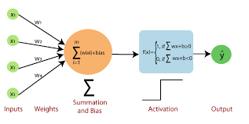
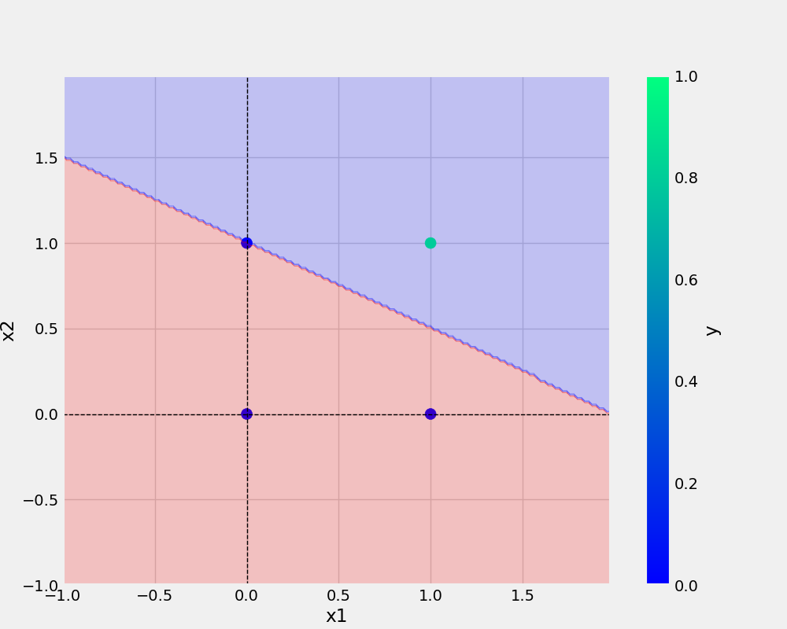
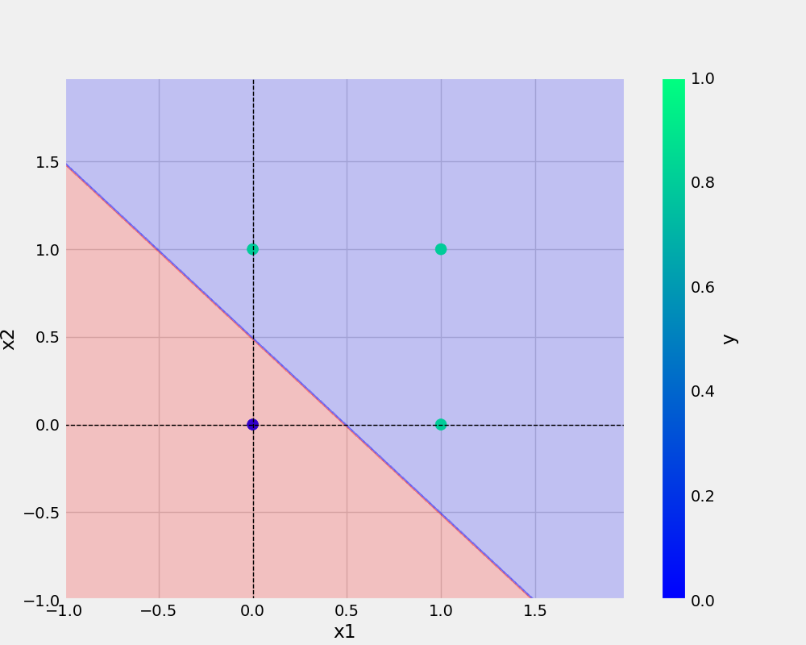

# oneNeuron
oneNeuron | perceptron

In machine learning, the perceptron is an algorithm for supervised learning of binary classifiers. 
A binary classifier is a function which can decide whether or not an input, represented by a vector of numbers, 
belongs to some specific class.



# commands used (bash) -

'''bash
git add . && git commit -m "message" && git push origin main
'''

'''bash
cp Research\ notebooks/demo.ipynb
'''

[Linkedin] (www.linkedin.com/in/atishay--jain)

# Graphs:-
## AND gate

## OR gate



'''
# Python code:-
```python
import numpy as np

class Perceptron:
  def __init__(self, eta, epochs):
    self.weights = np.random.randn(3) * 1e-4 # SMALL WEIGHT INIT
    print(f"initial weights before training: \n{self.weights}")
    self.eta = eta # LEARNING RATE
    self.epochs = epochs 


  def activationFunction(self, inputs, weights):
    z = np.dot(inputs, weights) # z = W * X
    return np.where(z > 0, 1, 0) # CONDITION, IF TRUE, ELSE

  def fit(self, X, y):
    self.X = X
    self.y = y

    X_with_bias = np.c_[self.X, -np.ones((len(self.X), 1))] # CONCATINATION
    print(f"X with bias: \n{X_with_bias}")

    for epoch in range(self.epochs):
      print("--"*10)
      print(f"for epoch: {epoch}")
      print("--"*10)

      y_hat = self.activationFunction(X_with_bias, self.weights) # foward propagation
      print(f"predicted value after forward pass: \n{y_hat}")
      self.error = self.y - y_hat
      print(f"error: \n{self.error}")
      self.weights = self.weights + self.eta * np.dot(X_with_bias.T, self.error) # backward propagation
      print(f"updated weights after epoch:\n{epoch}/{self.epochs} : \n{self.weights}")
      print("#####"*10)


  def predict(self, X):
    X_with_bias = np.c_[X, -np.ones((len(X), 1))]
    return self.activationFunction(X_with_bias, self.weights)

  def total_loss(self):
    total_loss = np.sum(self.error)
    print(f"total loss: {total_loss}")
    return total_loss

```


## Dataset:-
## AND gate

x1 | x2 | y
-|-|-|
0|0|0
0|1|0
1|0|0
1|1|1

## OR gate

x1 | x2 | y
-|-|-|
0|0|0
0|1|1
1|0|1
1|1|1
